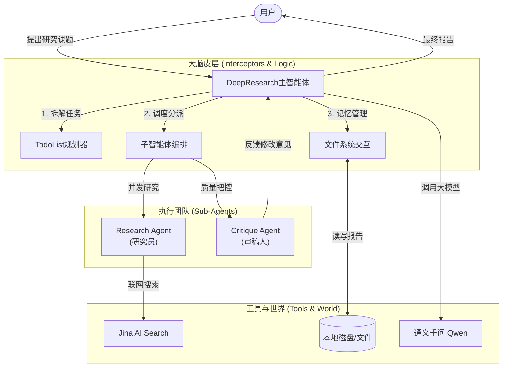

# DeepResearch Agent 技术架构设计文档

> **文档目的**：本文档旨在深入浅出地通过 Spring AI Alibaba 的 `DeepResearch` 示例，解析构建一个生产级“深度研究智能体”的技术架构与核心思想。本文档适合架构师、开发者及 AI 爱好者阅读。

## 1. 系统概述 (System Overview)

**DeepResearch Agent** 是一个模仿人类研究员工作模式的 AI 智能体。与普通的 ChatBot 不同，它不会立即回答问题，而是通过**规划、拆解、多渠道发散研究、整理归纳、反思修订**的严谨流程，最终生成一份高质量的研究报告。

它不是一个简单的“调用者”，而是一个具备**元认知（Metacognition）**能力的“思考者”。它利用 Spring AI Alibaba 的 Graph（图）计算引擎，将复杂的思维过程具象化为代码逻辑。

### 核心能力
- **🧠 自动任务规划**：自动将模糊的大目标拆解为可执行的 Todo List。
- **🤝 多智能体协作**：主智能体指挥“研究专员”和“审稿专员”分工合作。
- **💾 外部记忆挂载**：通过文件系统读写能力，突破 LLM 的 Context Window 限制，实现“无限”知识积累。
- **🔌 开放工具生态**：通过 MCP (Model Context Protocol) 协议无缝接入互联网搜索（Jina AI）等外部能力。

---

## 2. 宏观架构 (High-Level Architecture)

整个系统采用 **"Hiring a Team"（雇佣团队）** 的架构模式。DeepResearchAgent 是这个团队的“项目经理”，它协调多个组件协同工作。

---

## 3. 核心技术组件 (Core Components)

Spring AI Alibaba 采用 **"Graph as Code"** 的理念，通过 `ReactAgent` 和一系列 `Interceptor`（拦截器）由内而外地构建智能体。

### 3.1 核心大脑：ReactAgent
`ReactAgent` 实现经典的 **ReAct (Reasoning + Acting)** 循环。
- **Think（思考）**：分析当前状态，决定下一步做什么。
- **Act（行动）**：调用工具（Topic Search, Write File 等）。
- **Observe（观察）**：获取工具执行结果，更新上下文。

### 3.2 关键拦截器 (Interceptors) - 赋予智能体"技能"
拦截器是 DeepResearch 的灵魂，它们像“插件”一样插在 LLM 的思考回路中，赋予其特殊能力：

| 拦截器 (Interceptor) | 角色比喻 | 技术作用 |
| :--- | :--- | :--- |
| **TodoListInterceptor** | **项目经理** | 维护一个动态的 `TODO` 列表。LLM 每执行一步，它都强制 LLM 更新列表状态（Pending -> Processed -> Finished），确保任务不跑偏、不遗漏。 |
| **SubAgentInterceptor** | **分包商** | 允许主智能体通过函数调用（Function Call）启动另一个独立的 `ReactAgent`（子图）。例如：主智能体遇到“查询Spring架构”子任务时，会唤醒 `ResearchAgent` 去处理，主智能体挂起等待结果。 |
| **FilesystemInterceptor** | **记事本** | 赋予 Agent 读写本地文件的 `read_file`, `write_file` 等工具。这解决了 LLM 记不住太长内容的问题——它把中间结果写在磁盘上，需要时再读，实现了**“外挂显存”**。 |
| **LargeResultEviction** | **垃圾清理员** | 当某个工具返回了巨量的文本（例如抓取了整个网页源码），为了防止撑爆 Token 上限，它会自动把这些内容存为临时文件，只给 LLM 返回一个“文件路径引用”，不仅省钱还稳定。 |

### 3.3 钩子 (Hooks) - 系统的"反射神经"
Hooks 独立于思考循环之外，负责全局控制：
- **HumanInTheLoopHook**：**"核按钮"**。当 Agent 想要执行敏感操作（如 `search_web`）时，系统暂停，等待人类 User 点击“批准”才继续。体现了“人机协同”理念。
- **SummarizationHook**：**"睡前回忆"**。当对话历史太长时，自动触发后台模型对历史进行摘要压缩，防止遗忘早期指令。

---

## 4. 业务流程解析 (Workflow Deep Dive)

让我们跟踪一个实际请求：**“研究 Claude Code 和 GitHub Copilot 的技术区别”**。

### Phase 1: 规划与初始化 (Planning)
1. **启动**：用户输入问题。
2. **初始化**：`TodoListInterceptor` 介入，要求 LLM 先生成初始计划。
   - *LLM 输出*：1. 研究 Claude Code 架构; 2. 研究 Copilot 架构; 3. 对比分析; 4. 撰写报告。

### Phase 2: 并行研究 (Execution)
3. **分发任务**：主智能体处理 Item 1。
4. **调用子智能体**：主智能体调用 `research-agent`。
5. **深度搜索**：`research-agent` 拿到子任务，调用 `Jina AI` 联网搜索，通过 `write_file` 将大量原始素材写入 `scratchpad.txt`。
6. **回收结果**：子智能体向主智能体汇报：“已完成 Claude Code 研究，关键点如下...”。
7. **循环**：主智能体继续处理 Item 2，再次调用子智能体研究 Copilot。

### Phase 3: 综合与写作 (Synthesis)
8. **阅读素材**：主智能体使用 `read_file` 读取之前各阶段存下的素材。
9. **撰写初稿**：主智能体调用 `write_file` 将 `final_report.md` 写入磁盘。

### Phase 4: 审视与修正 (Critique & Refinement)
10. **自我审查**：主智能体调用 `critique-agent`（专门配置了严厉的审稿 Prompt）。
11. **提出意见**：`critique-agent` 阅读报告，指出：“缺乏对隐私安全的对比”。
12. **迭代修改**：主智能体接收反馈，重新调用搜索工具补充隐私相关资料，更新 `final_report.md`。

---

## 5. 核心代码落脚点 (Code Map)

如果您想自己动手修改，请关注以下文件：

- **`DeepResearchAgent.java`**:
  - **组装车间**：在这里通过 `ReactAgent.builder()` 将所有的 Interceptors 和 Hooks 组装在一起。
  - **提示词管理**：修改 `Prompts` 内部类可以调整 AI 的人设（比如让审稿人更严厉）。
  - **子智能体定义**：`createResearchAgent` 和 `createCritiqueAgent` 方法定义了专员的职责。

- **`AgentStaticLoader.java`**:
  - **启动器**：负责将 Agent 实例注入到 Spring 容器中，使其可以被 Web UI 或其他服务调用。

- **`application.yml`**:
  - **配置中心**：配置 MCP Client（连接 Jina AI）和 DashScope API Key。

## 6. 总结 (Conclusion)

DeepResearch 示例不仅仅是一个 Demo，它是一套**微缩的 AI 操作系统**。它展示了如何通过 Spring AI Alibaba 框架，将不稳定的大模型（LLM）通过确定性的代码逻辑（Graph/Interceptors）约束起来，从而解决复杂的、长周期的现实世界问题。

对于初学者，**理解 Interceptor（拦截器）机制是掌握 Agent 开发的关键**——它是连接“AI 概率世界”与“传统软件确定性世界”的桥梁。
